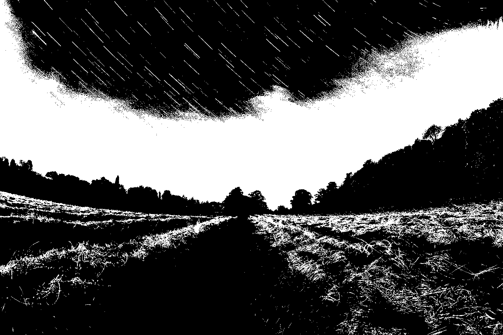
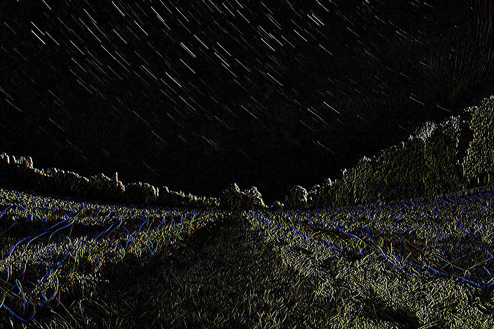
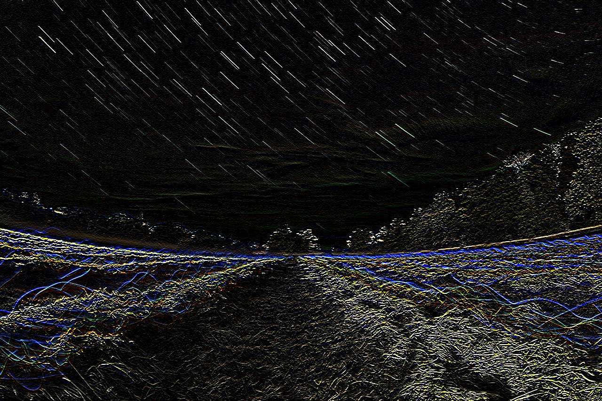

# VisionLite

> A lightweight, modular, and educational Computer Vision library written in modern C++17.

VisionLite is an open-source image processing library built from scratch using modern C++. The project is designed to help students, researchers, and developers understand how fundamental image processing algorithms work internally while providing a clean and reusable library for real-world applications.

Instead of relying on heavyweight frameworks, VisionLite focuses on simplicity, readability, modular architecture, and educational value.

---

## Why VisionLite?

Modern Computer Vision libraries are extremely powerful, but they often hide the implementation details of the algorithms they use.

VisionLite was created to solve this problem.

The main goal of this project is to provide a lightweight implementation of classical image processing algorithms that is easy to read, easy to extend, and suitable for learning.

Whether you are studying Digital Image Processing, Computer Vision, Artificial Intelligence, Machine Learning, or simply improving your C++ skills, VisionLite aims to be a useful learning resource.

---

## Key Features

### Image Processing

- BMP Image Loading
- BMP Image Saving
- Grayscale Conversion
- Brightness Adjustment
- Contrast Adjustment
- Thresholding

### Geometric Transformations

- Horizontal Flip
- Vertical Flip
- Image Rotation

### Convolution Filters

- Generic Convolution Engine
- Box Blur
- Gaussian Blur
- Sharpen Filter
- Sobel Edge Detection (X)
- Sobel Edge Detection (Y)

### Image Analysis

- Histogram Generation
- Mean Intensity
- Minimum Intensity
- Maximum Intensity
- Dominant Intensity
- Contrast Measurement

### Image Enhancement

- Auto Brightness
- Auto Contrast
- Gamma Correction
- Histogram Equalization

### Modern C++

- C++17
- CMake Build System
- Modular Architecture
- Easy to Extend
- No External Dependencies

---

# Demo

Below are several example outputs generated by VisionLite.

| Algorithm | Preview |
|-----------|---------|
| Grayscale |  |
| Threshold |  |
| Gamma Correction |  |
| Sobel X |  |
| Sobel Y |  |

---

# Project Architecture

```
                   +--------------------+
                   |       Image        |
                   +--------------------+
                              |
        +---------------------+----------------------+
        |                     |                      |
        ▼                     ▼                      ▼
    Filters              Analyzer              Enhancer
        |                     |                      |
        +---------------------+----------------------+
                              |
                              ▼
                      Processed Image
```

The project follows a modular architecture where each component has a single responsibility.

- **Image** manages pixel data.
- **Filters** perform image filtering operations.
- **Analyzer** extracts image statistics.
- **Enhancer** improves image quality.

This architecture makes the library easier to maintain, extend, and understand.

---

# Project Structure

```
VisionLite
│
├── assets
│   ├── demo
│   ├── input
│   └── output
│
├── examples
│
├── include
│   └── visionlite
│
├── src
│
├── CMakeLists.txt
│
├── README.md
│
└── LICENSE
```

| Folder | Description |
|----------|-------------|
| include | Public library headers |
| src | Library implementation |
| examples | Demo applications |
| assets/input | Input images |
| assets/output | Generated output images |
| assets/demo | Images shown in this README |

---

# Design Principles

VisionLite is developed around five core principles.

### Simplicity

Algorithms should be easy to understand.

### Readability

Readable code is more valuable than clever code.

### Modularity

Each module should have a single responsibility.

### Educational Value

The project is designed to help students understand how image processing algorithms work internally.

### Extensibility

Adding new algorithms should require minimal changes to the existing codebase.

---

Continue reading below to learn how to build the project, run the examples, and use VisionLite in your own applications.

# Getting Started

This section explains how to build and run VisionLite on your system.

## Prerequisites

Before building the project, make sure you have the following tools installed.

### Windows

- Visual Studio 2022 (or newer) with C++ Desktop Development tools
- CMake 3.20 or later
- Git

### Linux

- GCC (C++17 compatible)
- CMake 3.20 or later
- Git
- Make

---

# Clone the Repository

Clone the repository from GitHub.

```bash
git clone https://github.com/MahdiZeim/VisionLite.git
```

Move into the project directory.

```bash
cd VisionLite
```

---

# Build

## Windows

Generate the Visual Studio build files.

```bash
cmake -S . -B build
```

Compile the project.

```bash
cmake --build build
```

Run the demo application.

```bash
.\build\visionlite_demo.exe
```

---

## Linux

Generate the build files.

```bash
cmake -S . -B build
```

Compile.

```bash
cmake --build build
```

Run the demo.

```bash
./build/visionlite_demo
```

---

# Example Output

```
BMP Loaded: 1280x853

BMP Saved: assets/output/gray.bmp

Mean intensity: 104.62

Contrast: 66.12
```

The output images will be generated inside:

```
assets/output/
```

---

# Using VisionLite

Include the required headers.

```cpp
#include <visionlite/image.hpp>
#include <visionlite/bmp.hpp>
#include <visionlite/filters.hpp>
```

Load an image.

```cpp
     auto img =
        visionlite::BMP::load(
            "assets/input/test.bmp"
        );
```

Apply a filter.

```cpp
auto gray =
    visionlite::Filters::graysclae(img);
```

Save the result.

```cpp
visionlite::BMP::save("assets/output/gray.bmp");
```

---

# Implemented Algorithms

## Basic Filters

| Algorithm | Description |
|------------|-------------|
| Grayscale | Converts an RGB image to grayscale |
| Brightness | Increases or decreases image brightness |
| Contrast | Adjusts image contrast |
| Threshold | Converts grayscale images into binary images |

---

## Geometric Transformations

| Algorithm | Description |
|------------|-------------|
| Horizontal Flip | Mirrors the image horizontally |
| Vertical Flip | Mirrors the image vertically |
| Rotation | Rotates the image by multiples of 90 degrees |

---

## Convolution Filters

VisionLite provides a generic convolution engine that can execute different kernels without changing the filtering pipeline.

Implemented kernels include:

- Box Blur
- Gaussian Blur
- Sharpen
- Sobel X
- Sobel Y

The modular kernel system also allows developers to create custom convolution kernels.

---

## Image Analyzer

The Analyzer module extracts useful statistics from an image.

Current features include:

- Histogram Generation
- Mean Intensity
- Minimum Intensity
- Maximum Intensity
- Dominant Intensity
- Contrast Measurement

These statistics are useful for preprocessing, computer vision pipelines, and image enhancement algorithms.

---

## Image Enhancement

VisionLite currently implements several classical enhancement algorithms.

### Auto Brightness

Automatically adjusts image brightness based on the average intensity.

### Auto Contrast

Expands the intensity range using the minimum and maximum pixel values.

### Gamma Correction

Applies nonlinear intensity transformation using gamma correction.

### Histogram Equalization

Improves the distribution of pixel intensities by equalizing the histogram, making image details more visible in many low-contrast images.

---

# Performance

VisionLite is written in Modern C++17 and avoids unnecessary dynamic allocations whenever possible.

The library is designed to be:

- Lightweight
- Fast
- Easy to understand
- Easy to extend

Performance optimizations will continue in future releases.

---

# Who Is This Project For?

VisionLite is especially useful for:

- Computer Science students
- Artificial Intelligence students
- Computer Vision researchers
- Robotics developers
- Image Processing courses
- Machine Learning practitioners
- Anyone learning Modern C++

It can also serve as a reference implementation for educational purposes or as a starting point for larger computer vision projects.

---

# Roadmap

VisionLite is an actively evolving project. The following roadmap outlines the planned features for future releases.

## Version 0.2

- [ ] Median Filter
- [ ] Bilateral Filter
- [ ] Morphological Operations
- [ ] Performance Optimizations

## Version 0.3

- [ ] Image Resizing
- [ ] Arbitrary Angle Rotation
- [ ] PNG Support
- [ ] JPEG Support
- [ ] Image Cropping

## Version 0.4

- [ ] Canny Edge Detection
- [ ] Laplacian Filter
- [ ] Image Pyramids
- [ ] Noise Reduction Algorithms

## Version 1.0

- [ ] Feature Extraction
- [ ] Corner Detection
- [ ] Object Detection Utilities
- [ ] Benchmark Suite
- [ ] Complete Documentation
- [ ] Unit Tests
- [ ] Cross-platform Continuous Integration

The roadmap may evolve as the project grows and community feedback is received.

---

# Contributing

Contributions are welcome.

If you would like to improve VisionLite, you can contribute by:

- Fixing bugs
- Improving documentation
- Optimizing existing algorithms
- Implementing new image processing techniques
- Adding unit tests
- Improving code quality

Please open an Issue before making major changes so the proposed improvement can be discussed first.

If you find VisionLite useful, consider starring the repository. It helps other developers discover the project.

---

# Frequently Asked Questions

## Why was VisionLite created?

VisionLite was developed as an educational and lightweight alternative for learning classical image processing algorithms implemented in Modern C++.

---

## Does VisionLite depend on OpenCV?

No.

One of the main goals of the project is to implement image processing algorithms from scratch without relying on external computer vision libraries.

---

## Can I use this project for university assignments?

Yes.

VisionLite is intended to be a learning resource for students studying subjects such as:

- Digital Image Processing
- Computer Vision
- Artificial Intelligence
- Machine Learning
- Robotics

However, understanding the algorithms is strongly encouraged rather than simply copying the implementation.

---

## Is this library production ready?

The project is under active development.

Although many implemented algorithms are fully functional, new features, optimizations, and improvements will continue to be added.

---

# Project Goals

VisionLite is more than just another image processing library.

The long-term vision of the project is to become a lightweight educational framework that demonstrates how classical computer vision algorithms work internally while maintaining clean software architecture and modern C++ design principles.

The project aims to bridge the gap between theoretical university courses and practical software engineering.

---

# Contact

Questions, suggestions, bug reports, and collaboration ideas are always welcome.

**Academic Email**

mamiri@eng.uk.ac.ir

**Personal Email**

mahdiamiri511@gmail.com

If you discover a bug or would like to request a new feature, please open a GitHub Issue before sending an email whenever possible. This helps keep discussions public and makes it easier for others to benefit from them.

---

# License

This project is released under the MIT License.

See the LICENSE file for more information.

---

# Acknowledgements

Special thanks to all students, developers, researchers, and open-source contributors who share knowledge and inspire others to learn.

If VisionLite helps you in your studies, research, or software projects, consider giving the repository a ⭐ on GitHub.

Your support encourages future development and helps the project reach more learners around the world.