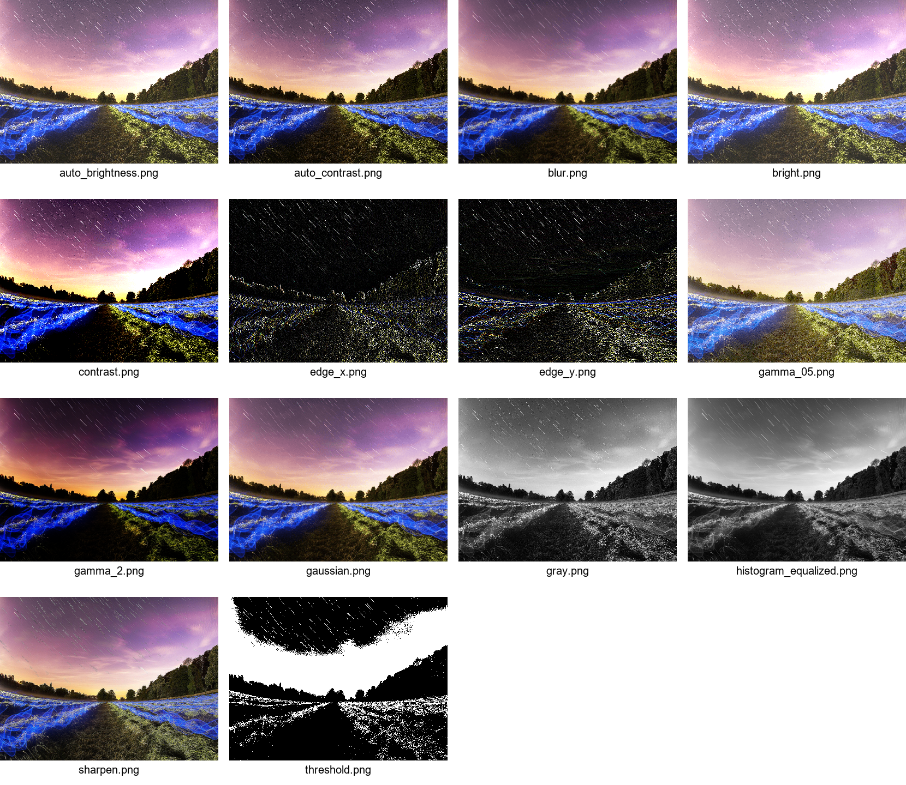
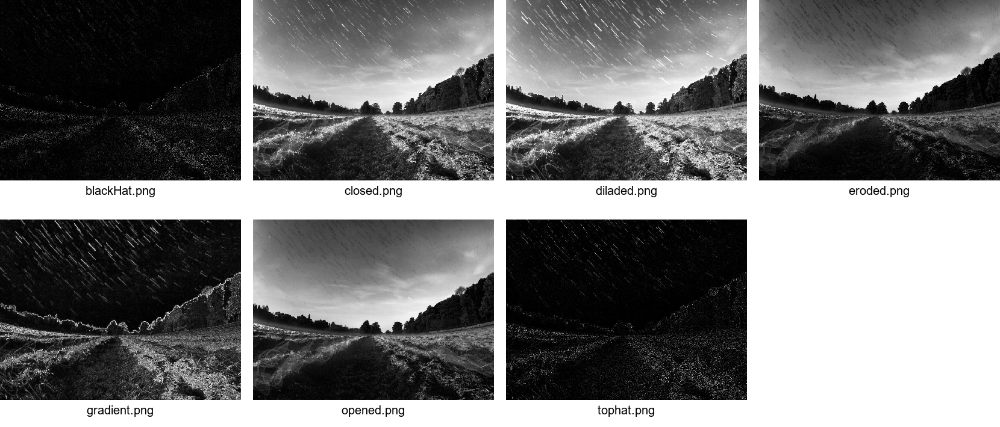

# VisionLite

> A lightweight, modular, and educational Computer Vision library written in modern C++17.

VisionLite is an open-source image processing library built from scratch using modern C++. The project is designed to help students, researchers, and developers understand how fundamental image processing algorithms work internally while providing a clean and reusable library for real-world applications.

Instead of relying on heavyweight frameworks, VisionLite focuses on simplicity, readability, modular architecture, and educational value.

---

## Why VisionLite?

Modern Computer Vision libraries are extremely powerful, but they often hide the implementation details of the algorithms they use.

VisionLite was created to solve this problem.

The main goal of this project is to provide a lightweight implementation of classical image processing algorithms that is easy to read, easy to extend, and suitable for learning.

Whether you are studying Digital Image Processing, Computer Vision, Artificial Intelligence, Machine Learning, or simply improving your C++ skills, VisionLite aims to be a useful learning resource.

---

## ✨ Current Features

| Category | Status |
|----------|--------|
| BMP Reader / Writer | ✅ |
| Image Class | ✅ |
| Convolution Filters | ✅ |
| Histogram Analysis | ✅ |
| Histogram Equalization | ✅ |
| Brightness / Contrast | ✅ |
| Gamma Correction | ✅ |
| Morphological Operations | ✅ |
| Drawing | 🚧 |
| Geometric Transformations | 🚧 |
| Color Spaces | 🚧 |

---

## 📦 Dependencies

- C++17
- CMake 3.15+
- No third-party image processing libraries

---


## 📸 Showcase

VisionLite includes a collection of classic image processing algorithms implemented from scratch in modern C++. Below are examples of the implemented filters and morphological operations.

---

### Image Filters

#### Input Image

<p align="center">
  
</p>

#### Filter Results

<p align="center">
  
</p>

Implemented filters include:

- Grayscale
- Threshold
- Brightness Adjustment
- Contrast Adjustment
- Gamma Correction
- Auto Brightness
- Auto Contrast
- Histogram Equalization
- Sharpen
- Box Blur
- Gaussian Blur
- Edge Detection (Horizontal & Vertical)

---

### Morphological Operations

#### Input Image

<p align="center">
  
</p>

#### Morphology Results

<p align="center">
  
</p>

Implemented morphology operations include:

- Erosion
- Dilation
- Opening
- Closing
- Morphological Gradient
- Top Hat
- Black Hat

---

# Project Structure

```
VisionLite
│
├── assets
│   ├── demo
│   ├── input
│   └── output
│
├── include
├── src
├── examples
├── tests
│
├── CMakeLists.txt
└── README.md

```

| Folder | Description |
|----------|-------------|
| include | Public library headers |
| src | Library implementation |
| examples | Demo applications |
| assets/input | Input images |
| assets/output | Generated output images |
| assets/demo | Images shown in this README |

---

# Design Principles

VisionLite is developed around five core principles.

### Simplicity

Algorithms should be easy to understand.

### Readability

Readable code is more valuable than clever code.

### Modularity

Each module should have a single responsibility.

### Educational Value

The project is designed to help students understand how image processing algorithms work internally.

### Extensibility

Adding new algorithms should require minimal changes to the existing codebase.

---

Continue reading below to learn how to build the project, run the examples, and use VisionLite in your own applications.

# Getting Started

This section explains how to build and run VisionLite on your system.

## Prerequisites

Before building the project, make sure you have the following tools installed.

### Windows

- Visual Studio 2022 (or newer) with C++ Desktop Development tools
- CMake 3.20 or later
- Git

### Linux

- GCC (C++17 compatible)
- CMake 3.20 or later
- Git
- Make

---

## 🚀 Quick Start

Clone the repository

```bash
git clone https://github.com/MahdiZeim/VisionLite.git
cd VisionLite
```

Configure the project

```bash
cmake -S . -B build
```

Build

```bash
cmake --build build
```

Run the demo

Windows

```bash
.\build\Debug\visionlite_demo.exe
```

Linux

```bash
./build/visionlite_demo
```

---

# Using VisionLite

Include the required headers.

```cpp
#include <visionlite/image.hpp>
#include <visionlite/bmp.hpp>
#include <visionlite/filters.hpp>
```

Load an image.

```cpp
     auto img =
        visionlite::BMP::load(
            "assets/input/test.bmp"
        );
```

Apply a filter.

```cpp
auto gray =
    visionlite::Filters::graysclae(img);
```

Save the result.

```cpp
visionlite::BMP::save("assets/output/gray.bmp");
```

---


# Performance

VisionLite is written in Modern C++17 and avoids unnecessary dynamic allocations whenever possible.

The library is designed to be:

- Lightweight
- Fast
- Easy to understand
- Easy to extend

Performance optimizations will continue in future releases.

---

# Who Is This Project For?

VisionLite is especially useful for:

- Computer Science students
- Artificial Intelligence students
- Computer Vision researchers
- Robotics developers
- Image Processing courses
- Machine Learning practitioners
- Anyone learning Modern C++

It can also serve as a reference implementation for educational purposes or as a starting point for larger computer vision projects.

---

## 🛣️ Roadmap

### v0.1

- [x] Image class
- [x] BMP reader
- [x] Filters

### v0.2

- [x] Morphology
- [x] Histogram Equalization
- [x] Documentation


### v0.3

- [ ] Drawing
- [ ] Resize
- [ ] Rotation

### v0.4

- [ ] Color Spaces
- [ ] Feature Detection

### v1.0

- [ ] Stable API
- [ ] Complete Documentation
---

# Contributing

Contributions are welcome.

If you would like to improve VisionLite, you can contribute by:

- Fixing bugs
- Improving documentation
- Optimizing existing algorithms
- Implementing new image processing techniques
- Adding unit tests
- Improving code quality

Please open an Issue before making major changes so the proposed improvement can be discussed first.

If you find VisionLite useful, consider starring the repository. It helps other developers discover the project.

---

# Frequently Asked Questions

## Why was VisionLite created?

VisionLite was developed as an educational and lightweight alternative for learning classical image processing algorithms implemented in Modern C++.

---

## Does VisionLite depend on OpenCV?

No.

One of the main goals of the project is to implement image processing algorithms from scratch without relying on external computer vision libraries.

---

## Can I use this project for university assignments?

Yes.

VisionLite is intended to be a learning resource for students studying subjects such as:

- Digital Image Processing
- Computer Vision
- Artificial Intelligence
- Machine Learning
- Robotics

However, understanding the algorithms is strongly encouraged rather than simply copying the implementation.

---

## Is this library production ready?

The project is under active development.

Although many implemented algorithms are fully functional, new features, optimizations, and improvements will continue to be added.

---

# Project Goals

VisionLite is more than just another image processing library.

The long-term vision of the project is to become a lightweight educational framework that demonstrates how classical computer vision algorithms work internally while maintaining clean software architecture and modern C++ design principles.

The project aims to bridge the gap between theoretical university courses and practical software engineering.

---

## 📬 Contact

For questions, suggestions, or collaboration opportunities:

- **Mohammadmahdi Amiri**
- 📧 mamiri@eng.uk.ac.ir
- 📧 mahdiamiri511@gmail.com

---

# Acknowledgements

Special thanks to all students, developers, researchers, and open-source contributors who share knowledge and inspire others to learn.

If VisionLite helps you in your studies, research, or software projects, consider giving the repository a ⭐ on GitHub.

Your support encourages future development and helps the project reach more learners around the world.